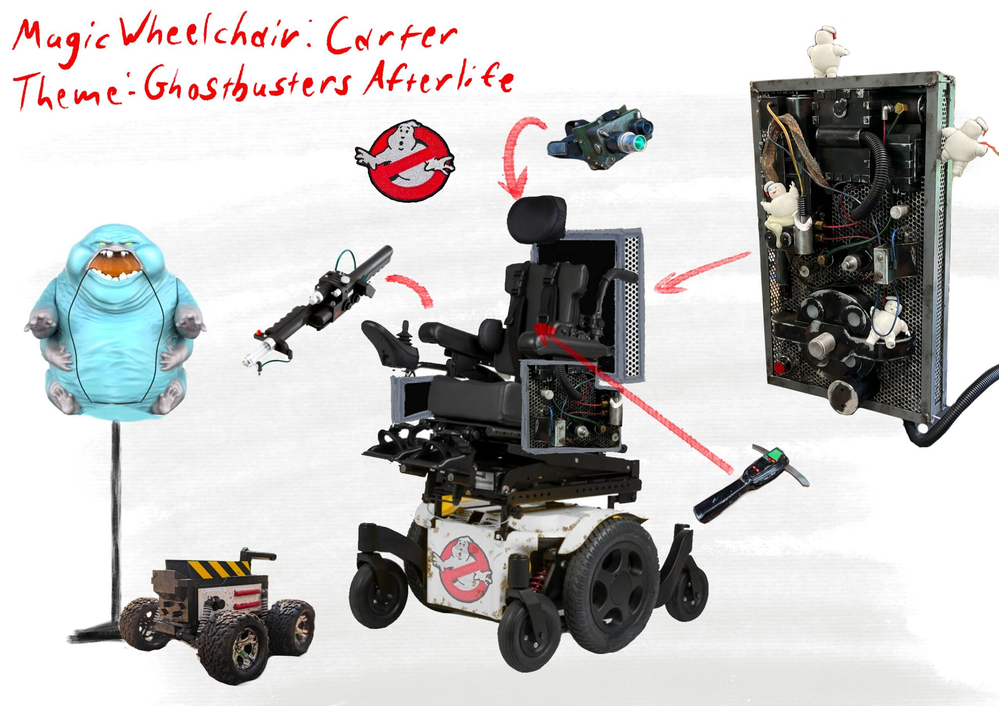

# mwc-ghostbusters
A repo to hold files for the Magic Wheelchair Ghostbusters build to be revealed in June 2022

This build was created by Stefan Price and the team at Makers Hollow.

This code includes an arduino-based RC car interface which allows the use of a wired XBOX ONE controller.

